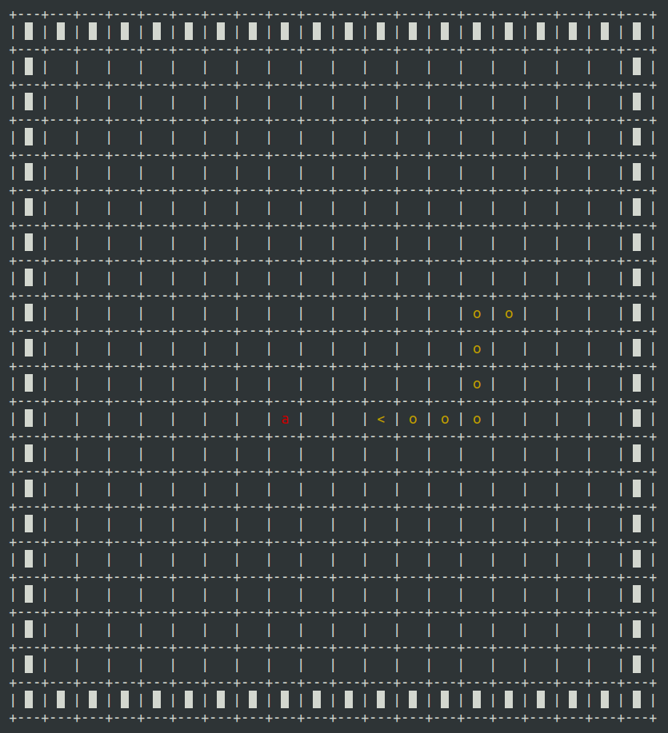

# snake_c

A snake game developed in C

## Version

***Version 1.0***

## How to use ?

first clone the project with the following command:

```sh
git clone https://github.com/Amayas29/snake_c
```

- **make sure you are in the snake_c directory (with `cd` command)**

then build and run the project enter the followings commands:

```sh
make
make run
```

## Example



## Todo

- [ ] Improve the snake's movements
- [ ] Improve direction change
- [ ] Improve apple generation
  